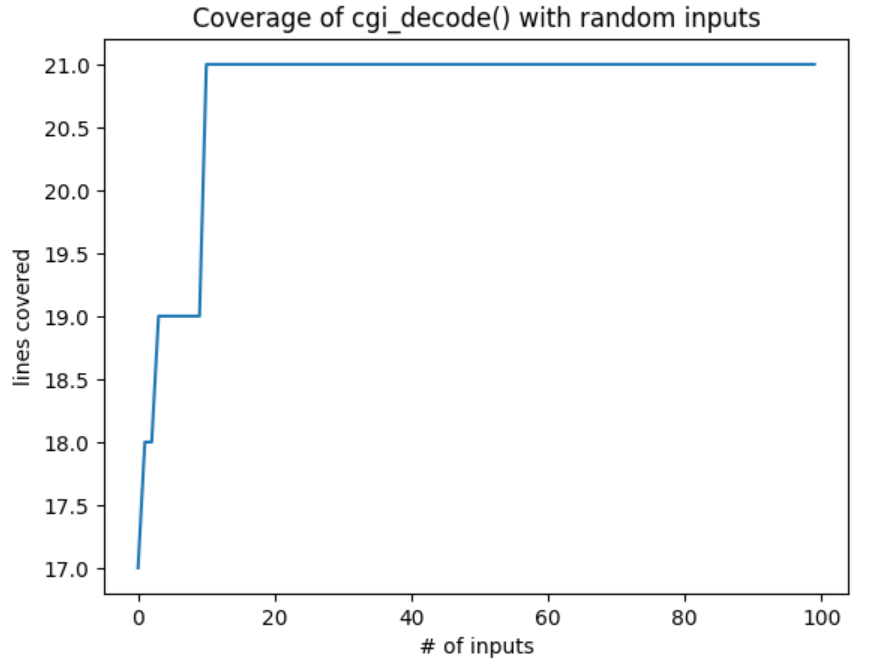

# Code Coverage

在[上一章](../part_2/fuzzing_inputs.md)中，我们介绍了基础模糊测试——即通过生成随机输入来测试程序。如何衡量这些测试的有效性？一种方法是检查发现错误的数量（及其严重性）；但如果错误稀少，我们就需要一个替代指标来评估测试发现错误的可能性。本章将介绍代码覆盖率的概念，即测量测试运行期间程序实际被执行的部分。对于试图覆盖尽可能多代码的测试生成器而言，覆盖率测量也至关重要。

- 前置条件
    - 你需要对程序的执行流程有一定的了解
    - 完成上一章节的学习

## A CGI Decoder

我们首先介绍一个简单的 Python 函数，该函数用于解码 CGI 编码字符串。CGI 编码常用于 URL（即网络地址）中，用于对 URL 中无效的字符（例如空格和某些标点符号）进行编码：

- 空格被替换为 `+`
- 其他无效字符被替换为 `%xx`，其中 `xx` 是两位十六进制等价值

因此，在 CGI 编码中，字符串 "Hello, world!" 会被转换为 "Hello%2c+world%21"。其中 2c 和 21 分别是逗号 (',') 和感叹号 ('!') 的十六进制表示。

函数 cgi_decode() 的功能是接收经过此类编码的字符串，并将其解码还原为原始形式。我们的实现复现了[Pezzè 等人，2008 年](http://ix.cs.uoregon.edu/~michal/book/)中的代码（该实现甚至包含了原代码中的缺陷——不过我们暂时不会在此处揭示它们）。

``` py
{{#include ../codes/Coverage.py:2:33}}
```

如果我们想要系统性地测试 cgi_decode() 函数，应该如何进行？测试领域文献中区分了两种推导测试用例的方法：黑盒测试与白盒测试。

## Black-Box Testing

黑盒测试的核心思想是从功能规范中推导测试用例。就上述案例而言，我们需要根据明确定义的功能特性来测试 cgi_decode() 函数，包括：

- 测试 `+` 的正确替换
- 测试 `%xx` 的正确替换
- 测试不替换其他字符的情况
- 测试对非法输入的识别情况

``` py
assert cgi_decode('+') == ' '
assert cgi_decode('%20') == ' '
assert cgi_decode('abc') == 'abc'

try:
    cgi_decode('%?a')
    assert False
except ValueError:
    pass
```

**黑盒测试的优势在于能够发现与规范要求不符的行为偏差。由于它独立于具体实现，甚至可以在编码完成前就提前设计测试用例。但其局限性在于，实际代码的行为通常比规范描述更复杂，仅基于功能规格设计的测试往往无法覆盖所有实现细节**。

## White-Box Testing

与黑盒测试相反，白盒测试从代码实现（特别是内部结构）中推导测试用例。白盒测试与代码结构特征的覆盖概念紧密相关。例如，如果测试期间未执行某条代码语句，则意味着该语句中的错误也无法被触发。因此，白盒测试提出了一系列覆盖率标准，必须满足这些标准才能认为测试是充分的。最常用的覆盖率标准包括：

- 语句覆盖——代码中的每条语句必须被至少一个测试输入执行到。
- 分支覆盖——代码中的每个分支必须被至少一个测试输入执行到（这相当于要求每个 if 和 while 判断条件至少一次为真，一次为假）。

除此之外，还有更多覆盖率标准，包括已执行的分支序列、循环迭代次数（零次、一次、多次）、变量定义与使用之间的数据流等等；[Pezzè等人，2008 年](http://ix.cs.uoregon.edu/~michal/book/)的著作对此有全面概述。

让我们以上文的 cgi_decode() 函数为例，思考如何确保代码中的每条语句至少被执行一次。我们需要覆盖以下情况：

- 条件判断 if c == '+'对应的代码块
- 条件判断 if c == '%'对应的两个分支（有效输入情况与无效输入情况）
- 处理其他字符的最终 else 情况

这导致了与前述黑盒测试相同的测试条件；上述断言确实能够覆盖代码中的每条语句。这种对应关系实际上相当常见，因为程序员倾向于在不同的代码位置实现不同功能，因此覆盖这些代码位置自然会生成覆盖不同（规范定义的）行为的测试用例。

**白盒测试的优势在于能够发现已实现代码中的错误。即使在规格说明缺乏足够细节的情况下，它依然可以执行测试；实际上，它有助于识别（从而补充说明）规格说明中的边界情况。其缺点在于可能遗漏未实现的功能：如果某些规范要求的功能未被编码实现，白盒测试将无法发现这类缺失**。

## Tracing Executions

白盒测试的一个显著特点是能够自动评估程序功能是否被覆盖。为此，我们需要对程序执行进行插装——即在运行过程中通过特定机制追踪已执行的代码。测试结束后，这些信息可反馈给开发人员，使其能专注于为未覆盖的代码编写测试用例。

在大多数编程语言中，配置程序以追踪其执行过程相当困难。但 Python 则不然。通过 sys.settrace(f) 函数，我们可以定义一个追踪函数 f()，该函数会在每行代码执行时被调用。更强大的是，它能获取当前函数及其名称、当前变量内容等信息。因此，它成为动态分析（即对实际执行过程进行分析）的理想工具。

为了说明其工作原理，让我们再次观察 cgi_decode() 函数的一次具体执行过程。

``` py
cgi_decode("a+b")
```

为了追踪 cgi_decode() 函数的执行过程，我们将利用 sys.settrace() 方法。首先，我们需要定义一个会被每行代码调用的追踪函数。该函数包含三个参数：

- frame 参数用于获取当前执行帧，可访问当前位置和变量信息：
    - frame.f_code 是当前执行的代码对象，frame.f_code.co_name 表示函数名；
    - frame.f_lineno 记录当前行号；
    - frame.f_locals 包含当前局部变量和参数。
- event 参数是描述事件类型的字符串，常见值包括"line"（执行到新行）或"call"（函数被调用）。
- arg 参数为某些事件提供附加信息，例如对于"return"事件，arg 包含返回值。

我们利用追踪函数来简单报告当前执行的代码行，该信息通过 frame 参数获取。

``` py
{{#include ../codes/Coverage.py:38:55}}
```

详细的代码介绍在原文中有介绍，请参考 [Tracing-Executions](https://www.fuzzingbook.org/html/Coverage.html#Tracing-Executions)。此处不再着重介绍。

## A Coverage Class

在这本书中，我们将反复利用覆盖率——来衡量不同测试生成技术的有效性，同时也引导测试生成朝着代码覆盖率的方向发展。我们之前的全局 coverage 变量实现在这方面有些繁琐。因此，我们实现了一些功能来帮助我们轻松测量覆盖率。

但是，我们主要关注于是如何使用该类进行覆盖率测试，因此也不再赘述其实现。

``` py
with Coverage() as cov:
    function_to_be_traced()
c = cov.coverage()
```

## Comparing Coverage

由于我们将覆盖率表示为一组执行的行，因此我们也可以对这些行应用集合运算。例如，我们可以找出哪些行被单个测试用例覆盖，而其他测试用例没有覆盖：

``` py
with Coverage() as cov_plus:
    cgi_decode("a+b")
with Coverage() as cov_standard:
    cgi_decode("abc")

cov_plus.coverage() - cov_standard.coverage()
```

输出的结果是仅在在 'a+b' 输入中执行的行。我们还可以通过比较集合来确定哪些代码行仍需覆盖。定义 cov_max 为我们能实现的最大覆盖率。（这里，我们通过执行已有的"优质"测试用例来实现。实际操作中，人们会静态分析代码结构——这部分内容我们将在[符号测试章节](../part_4/symbolic_fuzz.md)中介绍。）

``` py
with Coverage() as cov_max:
    cgi_decode('+')
    cgi_decode('%20')
    cgi_decode('abc')
    try:
        cgi_decode('%?a')
    except Exception:
        pass
```

## Coverage of Basic Fuzzing

现在我们可以利用覆盖率追踪来评估测试方法的有效性——尤其是测试生成方法的效果。我们的挑战在于：仅使用随机输入，就要让 cgi_decode() 函数达到最大覆盖率。从理论上说，只要我们最终生成了宇宙中所有可能的字符串，就必然能达到目标——但这个过程究竟需要多久呢？为此，让我们先对 cgi_decode() 进行一次模糊测试迭代。

``` py
sample = fuzzer()

with Coverage() as cov_fuzz:
    try:
        cgi_decode(sample)
    except:
        pass
cov_fuzz.coverage()
```

通过如下操作来检查是否到达最大覆盖率：

``` py
cov_max.coverage() - cov_fuzz.coverage()
```

让我们再尝试一次，通过 100 个随机输入来提高覆盖率。我们使用一个名为 cumulative_coverage 的数组来记录随时间推移所达到的覆盖率：cumulative_coverage[0]表示输入第 1 个样本后覆盖的代码行总数，cumulative_coverage[1]表示输入第 1 至第 2 个样本后覆盖的代码行数，依此类推。



当然，上面的图表只是经过了一次测试后的结果，让我们进行多次重复并绘制平均值可以发现，在 40-60 个模糊测试输入后，我们获得了完整的覆盖率。

## Finding Errors with Basic Fuzzing

只要有足够的时间，无论采用何种编程语言，我们确实能够覆盖 cgi_decode() 函数中的每一行代码。不过，这并不意味着代码就完全没有错误。由于我们并未检查 cgi_decode() 的返回结果，该函数可能返回任意值而不会被我们察觉或验证。要捕捉这类错误，就需要设置一个结果校验器（通常称为"预言机"）来验证测试结果。在我们的案例中，可以通过对比 C 语言和 Python 语言实现的 cgi_decode() 函数，检查两者是否产生相同的结果。

然而，模糊测试真正擅长的领域在于发现那些即使不检查结果也能检测到的内部错误。
