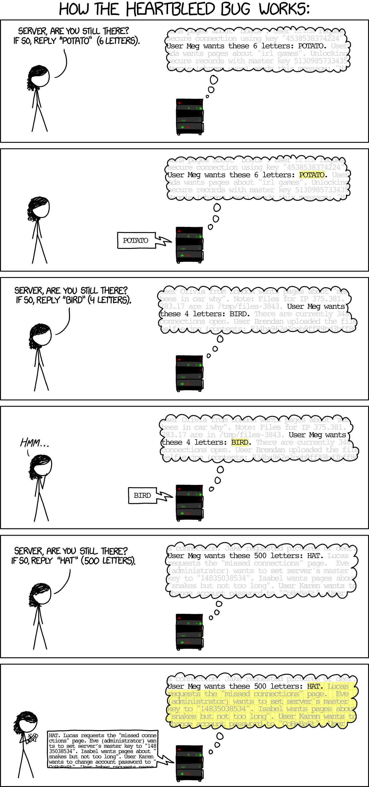
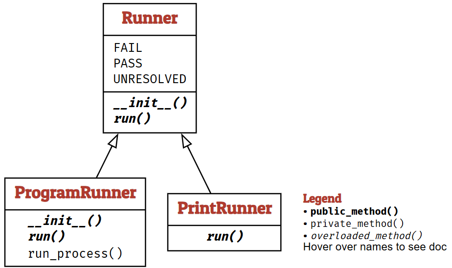
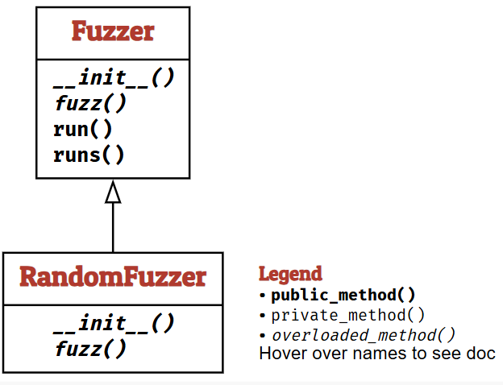

# Fuzzing: Breaking Things with Random Inputs

在本章中，我们将从最简单的测试生成技术之一开始。随机文本生成（也称为模糊测试）的核心思想是向程序输入一串随机字符，以期发现程序中的故障。

- 前提条件：
    - 你应该了解过软件测试的基础只是；例如，从[软件测试导论](../part_1/introduction.md)这一章中。
    - 你应该对 `Python` 有相当的了解。

## A Testing Assignment

模糊测试诞生于["dark and stormy night in the Fall of 1988" [Takanen 等人，2008]](http://us.artechhouse.com/Fuzzing-for-Software-Security-Testing-and-Quality-Assurance-Second-Edition-P1930.aspx)。当时，Barton Miller 教授正坐在他位于威斯康星州麦迪逊市的公寓里，通过一条 1200 波特的电话线连接到他的大学计算机。雷暴在线上引起了噪音，而这些噪音又导致两端的 UNIX 命令接收到错误输入——并导致崩溃。频繁的崩溃让他感到惊讶——程序本应比这更加健壮才对啊？作为科学家，他想深入研究这个问题的严重程度及其成因。于是，他为威斯康星大学麦迪逊分校的学生设计了一个编程练习——这个练习将让他的学生们创造出第一批模糊测试器。

> 以下是[作业](http://pages.cs.wisc.edu/~bart/fuzz/CS736-Projects-f1988.pdf)的内容
>
> 该项目的目标是评估各种 UNIX 实用程序在接收到不可预测的输入流时的鲁棒性。[...] 首先，你需要构建一个模糊生成器。这是一个会输出随机字符流的程序。其次，你将使用这个模糊生成器来攻击尽可能多的 UNIX 实用程序，目标是试图使它们崩溃。

这项任务抓住了模糊测试的精髓：生成随机输入，然后观察它们是否会引发程序故障。只要让它运行足够长的时间，你就会看到结果。

## A Simple Fuzzer

让我们尝试完成这个任务，构建一个模糊生成器。其核心思路是生成随机字符，将它们添加到一个缓冲区字符串变量 (out) 中，最后返回这个字符串。

``` py
def fuzzer(
    max_length: int = 100,
    char_start: int = 32,
    char_range: int = 32
) -> str:
    string_length = random.randrange(0, max_length + 1)
    out = ""
    for i in range(0, string_length):
        out += chr(random.randrange(char_start, char_start + char_range))
    return out
```

如上面代码所示，这就是一个简单实际的 `fuzzer` 函数。使用默认参数时， `fuzzer()` 函数返回一串随机字符：

``` bash
'!7#%"*#0=)$;%6*;>638:*>80"=</>(/*:-(2<4 !:5*6856&?""11<7+%<%7,4.8,*+&,,$,."'
```

Bart Miller 将这种随机的、无结构的数据命名为 `fuzz`。现在试想，**如果这个 `fuzz` 字符串被输入到一个需要特定输入格式（例如逗号分隔的值列表或电子邮件地址）的程序中，该程序能否毫无问题地处理这样的输入？**

如果上述模糊测试输入已经让你觉得有趣，那么请设想一下：我们可以轻松设置模糊测试器来生成其他类型的输入。例如，我们也可以让 `fuzzer()` 生成一系列小写字母。这里我们使用 `ord(c)` 来返回字符 c 的 ASCII 码。

``` py
fuzzer(1000, ord('a'), 26)
```

## Fuzzing External Programs

让我们看看如果实际用模糊测试生成的输入来调用外部程序会发生什么。为此，我们将分两步进行：首先创建一个包含模糊测试数据的输入文件，然后将这个输入文件提供给目标程序。

### Creating Input Files

``` bash
basename = "input.txt"
tempdir = tempfile.mkdtemp()
FILE = os.path.join(tempdir, basename)
print(FILE)
```

这样我们就创建了一个临时文件。现在我们可以打开这个文件进行写入。Python 的 `open()` 函数会打开一个文件，之后我们就可以向其中写入任意内容。它通常与 with 语句结合使用，这样可以确保文件在使用完毕后会被立即关闭。

``` py
data = fuzzer()
with open(FILE, "w") as f:
    f.write(data)

contents = open(FILE).read()
print(contents)
assert(contents == data)
```

### Invoking External Programs

现在我们有了输入文件，就可以在其上调用程序了。为了增加趣味性，我们来测试一下 `bc` 计算器程序，这个程序会接收一个算术表达式并对其进行求值。

``` py
program = "bc"
with open(FILE, "w") as f:
    f.write("2 + 2\n")
result = subprocess.run(
    [program, FILE],
    stdin=subprocess.DEVNULL,
    stdout=subprocess.PIPE,
    stderr=subprocess.PIPE,
    universal_newlines=True
)
result.stdout
```

我们可以通过运行结果来检查程序的输出。对于 bc 程序来说，`result.stdout` 就是算术表达式的求值结果。我们还可以检查其退出状态码：值为 0 表示程序正常终止。任何错误信息都会显示在  `results.stderr` 中。实际上，您可以用任何您喜欢的程序来替代 bc。但请注意，如果您的程序有能力更改甚至损坏您的系统，那么存在相当大的风险——模糊测试生成的输入数据或命令很可能恰好会触发这种破坏性操作。

> 仅仅出于有趣的设想，假设您要测试一个文件删除程序——比如 `rm -fr FILE`，其中 FILE 是由 `fuzzer()` 生成的字符串。那么，fuzzer()（使用默认参数）产生一个会导致删除您所有文件的 FILE 参数的可能性有多大呢？

实际上，这种可能性可能比您想象的要高。例如，如果您删除 `/`（即文件系统的根目录），那么您的整个文件系统都会消失。如果您删除 `.`（当前目录），那么当前目录中的所有文件都会消失。

生成一个恰好为 `1` 个字符长的字符串的概率是 \\( \frac{1}{101} \\)。这是因为字符串的长度是通过调用 `random.randrange(0, max_length + 1)` 来确定的，其中 `max_length` 的默认值为 100。根据对 `random.randrange` 的描述，它应该返回 \\( \[0, 99 + 1) \\) 范围内的一个随机数。因此，我们最终得到的是包含两端点的区间 \\( \[0, 100\] \\)，该区间内共有 101 个可能的值。

要生成 `/` 或 `.`，你需要满足两个条件：字符串长度必须为 1（概率：101 分之一），并且字符必须是这两个字符之一（概率：32 分之二）。

\\[
    \frac{1}{101} \times \frac{2}{32} = 0.0006188118811881188
\\]

上述代码块排除了删除 `~`（您的主目录）的可能性，这是因为生成字符 `~` 的概率不是 1/32，而是 0/32。字符是通过调用 `chr(random.randrange(char_start, char_start + char_range))` 创建的，其中 char_start 的默认值为 32，char_range 的默认值为 32。chr 函数的文档说明："返回表示 Unicode 码点为整数 i 的字符的字符串"。字符 `~` 的 Unicode 码点是 126，因此不在区间 \\( \[32, 64) \\) 内。

如果代码被修改，使 `char_range = 95`，那么获得字符 `~` 的概率将是 1/94，从而导致（删除所有文件的）事件概率等于 0.000332。这样一来，您主目录中的所有文件都将消失。

\\[
    \frac{3}{94} \times \frac{1}{94} \times \frac{99}{101} = 0.0003327969736765437
\\]

然而，实际上只要字符串的第二个字符是空格，任何内容都可能造成破坏——毕竟，`rm -fr / WHATEVER` 会先处理 `/`，然后再处理后面的内容。第一个字符是 `/` 或 `.` 的概率是 2/32，因为上面的代码块只允许生成 `/` 或 `.`，而不包含 `~`。

对于空格字符，其出现概率是 \\( \frac{1}{32} \\)。我们必须引入"字符串长度至少为 2 个字符"这一事件的概率项，因为只有满足这个条件，才可能出现第二个字符是空格的情况。这个概率是 \\( \frac{99}{101} \\)，因为它等于 1 减去（字符串长度为 0 或 1 个字符的概率），即 \\( 1 - \frac{2}{101} \\)。

因此，在第二个字符是空格的情况下，导致删除所有文件的事件概率计算为：

\\[
    P_{del} = P_{'/'\ or\ '.'} \times P_{'\ '} \times P_{2 char} = \frac{2}{32} \times \frac{1}{32} \times \frac{99}{101} = 0.0019144492574257425
\\]

考虑到模糊测试通常要运行数百万次，您绝对不想冒这个风险。请在一个可以随意重置的安全环境（例如 Docker 容器）中运行您的模糊测试器。

### Long-Running Fuzzing

现在让我们将大量输入数据馈送到被测程序中，以观察它是否会在某些输入上崩溃。我们将所有结果（输入数据与实际运行结果成对）存储在 `runs` 变量中。（注意：运行此操作可能需要一些时间。）

``` py
trials = 100
program = "bc"

runs = []

for i in range(trials):
    data = fuzzer()
    with open(FILE, "w") as f:
        f.write(data)
    result = subprocess.run([program, FILE],
                            stdin=subprocess.DEVNULL,
                            stdout=subprocess.PIPE,
                            stderr=subprocess.PIPE,
                            universal_newlines=True)
    runs.append((data, result))
```

我们现在可以查询 runs 变量以获取一些统计信息。例如，我们可以查询有多少次运行实际通过了——也就是说，没有产生错误信息。

``` py
sum(1 for (data, result) in runs if result.stderr == "")
```

大多数输入显然是无效的——这并不奇怪，因为随机输入不太可能包含有效的算术表达式。

## Bugs Fuzzers Find

当 Miller 和他的学生在 1989 年运行他们的第一批模糊测试器时，他们发现了一个令人震惊的结果：大约有三分之一的被测试 UNIX 实用程序存在问题——它们在面对模糊测试输入时会崩溃、挂起或以其他方式失效 [Miller 等人，1990](https://doi.org/10.1145/96267.96279)。这其中也包括上面提到的 bc 程序。（不过上面使用的 bc 是一个现代重新实现的版本，其作者是模糊测试的坚定拥护者！）

考虑到当时许多这类 UNIX 实用程序被用于处理网络输入的脚本中，这个结果可谓敲响了警钟。程序员们迅速构建并运行自己的模糊测试器，紧急修复已报告的错误，并从此学会了不再轻信外部输入。

Miller 的模糊测试实验究竟发现了哪些问题？事实证明，1990 年程序员们犯的错误，与今天人们犯的错误如出一辙。

### Buffer Overflows

许多程序对输入及输入元素的长度设有内置限制。在 C 这类语言中，很容易在程序（甚至程序员）毫无察觉的情况下超出这些长度限制，从而引发所谓的缓冲区溢出。例如，下面这段代码会直接将输入字符串复制到工作日字符串中，即使输入超过八个字符也不例外：

``` c
char weekday[9]; // 8 characters + trailing '\0' terminator
strcpy (weekday, input);
```

具有讽刺意味的是，当输入是 "Wednesday"（9 个字符）时，这个问题就会暴露：多出的字符（这里的 'y' 和随后的字符串终止符 '\0'）会直接覆盖到 weekday 之后的内存区域，从而引发不可预知的行为——比如可能改变某个布尔字符变量的值，使其从 'n' 变为 'y'。通过模糊测试，可以非常容易地生成超长输入和输入元素。

我们可以在 Python 函数中轻松模拟这种缓冲区溢出行为：

``` py
def crash_if_too_long(s):
    buffer = "Thursday"
    if len(s) > len(buffer):
        raise ValueError
    
from ExpectError import ExpectError

trials = 100
with ExpectError():
    for i in range(trials):
        s = fuzzer()
        crash_if_too_long(s)
```

上述代码中的 `with ExpectError()` 行确保打印错误消息，但程序会继续执行；这是为了将此"预期"错误与其他代码示例中的"非预期"错误区分开来。

### Missing Error Checks

许多编程语言并不支持异常机制，而是在异常情况下让函数返回特殊的错误码。例如，C 语言中的 getchar() 函数通常从标准输入返回一个字符；如果没有更多输入可用，则返回特殊值 EOF（文件结束符）。现在假设程序员正在扫描输入以读取下一个字符，使用 getchar() 不断读入字符，直到读取到空格字符为止：

``` c
while (getchar() != ' ');
```

如果输入提前结束（这在模糊测试中是完全可以出现的情况）会发生什么？答案是：getchar() 会返回 EOF，并且再次被调用时会持续返回 EOF；因此上面的代码会直接陷入无限循环。

当然，我们可以模拟出这种缺失的错误检查，假如这是一个输入中没有空格就会挂起的函数：

``` py
def hang_if_no_space(s):
    i = 0
    while True:
        if i < len(s):
            if s[i] == ' ':
                break
        i += 1


trials = 100
with ExpectTimeout(2):
    for i in range(trials):
        s = fuzzer()
        hang_if_no_space(s)
```

利用我们在[测试导论](../part_1/introduction.md)中介绍的超时机制，我们可以在一定时间后中断这个函数。确实，在几次模糊输入后，它确实会陷入挂起状态。

### Rogue Numbers

通过模糊测试，可以轻松在输入中生成不常见的值，从而引发各种有趣的行为。请看下面这段同样用 C 语言编写的代码，它首先从输入中读取一个缓冲区大小，然后分配一个指定大小的缓冲区：

``` c
char *read_input() {
    size_t size = read_buffer_size();
    char *buffer = (char *)malloc(size);
    // fill buffer
    return (buffer);
}
```

如果 size 值非常大，超过了程序内存限制会怎样？如果 size 小于后续字符数量会怎样？如果 size 是负数又会怎样？通过在此处提供随机数值，模糊测试可以引发各种类型的破坏。

同样地，我们可以在 Python 中轻松模拟这类异常数值。如果传入的字符串值在转换为整数后过大，函数 `collapse_if_too_large()` 就会执行失败。

``` py
def collapse_if_too_large(s):
    if int(s) > 1000:
        raise ValueError

long_number = fuzzer(100, ord('0'), 10)
print(long_number)

with ExpectError():
    collapse_if_too_large(long_number)
```

如果我们真的试图在系统上分配如此大量的内存，像上面那样快速失败反而是更可取的方案。实际上，内存耗尽会急剧降低系统运行速度，甚至导致系统完全无响应——此时重启就成了唯一的选择。

有人可能会争辩说，这些都是糟糕的编程方式或糟糕的编程语言导致的问题。但现实是，每天都有成千上万的人开始学习编程，即使到了今天，他们仍在反复犯着同样的错误。

## Cathcing Errors

当 Miller 和他的学生构建第一个模糊测试器时，他们能识别错误，仅仅是因为程序会崩溃或挂起——这两种状态很容易判断。然而，如果故障更加隐蔽，我们就需要设计额外的检查机制。

### Generic Checkers

如上所述，[缓冲区溢出](#buffer-overflows)是一个更普遍问题的具体表现：在 C 和 C++ 这类语言中，程序可以访问其内存的任意部分——甚至是未初始化的、已释放的或根本不属于你试图访问的数据结构的内存区域。如果你要编写操作系统，这种能力是必要的；如果你追求极致性能或控制力，这也很棒；但如果你想避免错误，这就相当糟糕了。幸运的是，有一些工具可以在运行时帮助捕获此类问题，当它们与模糊测试结合使用时效果极佳。

#### Checking Memory Accesses

为了在测试期间捕获有问题的内存访问，可以在特殊的内存检查环境中运行 C 程序；这些工具会在运行时检查每一个内存操作，确认其访问的内存是否有效且已初始化。LLVM Address Sanitizer 就是一个流行范例，它能检测一整类潜在的危险性内存安全违规行为。在接下来的示例中，我们将使用该工具编译一个相当简单的 C 程序，并通过读取已分配内存区域之外的内容来故意引发一次越界读取。

``` c
{{#include ../codes/program.c}}
```

我们启用地址清理功能来编译这个 C 程序：

``` bash
clang -fsanitize=address -g -o program program.c
```

如果我们通过传递参数 `99` 运行该程序，它会返回 `buf[99]` 的值，即 42。

``` bash
./program 99; echo $?
program(2097,0x1ff330240) malloc: nano zone abandoned due to inability to reserve vm space.
42
```

然而，访问 buf[110]会导致 AddressSanitizer 报告越界错误。

``` bash
./program 110
program(2132,0x1ff330240) malloc: nano zone abandoned due to inability to reserve vm space.
=================================================================
==2132==ERROR: AddressSanitizer: heap-buffer-overflow on address 0x60b0000000ae at pc 0x000104927e84 bp 0x00016b4daa50 sp 0x00016b4daa48
READ of size 1 at 0x60b0000000ae thread T0
    #0 0x104927e80 in main program.c:12
    #1 0x1956d0270  (<unknown module>)

0x60b0000000ae is located 10 bytes after 100-byte region [0x60b000000040,0x60b0000000a4)
allocated by thread T0 here:
    #0 0x104e58c04 in malloc+0x94 (libclang_rt.asan_osx_dynamic.dylib:arm64e+0x54c04)
    #1 0x104927dc8 in main program.c:7
    #2 0x1956d0270  (<unknown module>)
......
```

如果您想在 C 程序中查找错误，在模糊测试时启用这类检查相当容易。这会使执行速度降低一定倍数（具体取决于工具，对于 AddressSanitizer 通常是 2 倍），同时消耗更多内存，但与人工发现这些错误所需付出的精力相比，CPU 周期成本简直微不足道。

内存越界访问会带来严重的安全风险，因为它可能允许攻击者访问甚至修改本不该被其获取的信息。一个著名的例子是 Heartbleed 漏洞，它是 OpenSSL 库中的一个安全缺陷，该库负责实现为计算机网络提供通信安全性的加密协议。（如果您正在通过浏览器阅读本文，内容很可能正是使用这些协议加密的。）

Heartbleed 漏洞的利用方式是向 SSL 心跳服务发送特制的命令。心跳服务用于检查另一端的服务器是否仍处于活动状态。客户端会向该服务发送一个类似以下示例的字符串：

``` bash
BIRD (4 letters)
```

服务器会回复 `BIRD` 作为响应，客户端由此可知服务器处于活动状态。

不幸的是，通过要求服务器返回比请求字母集更多的内容，该服务可能被利用。这一点在下面的 [XKCD 漫画](https://xkcd.com/1354/) 中得到了生动的解释：



在 OpenSSL 的实现中，这些内存内容可能包含加密证书、私钥等敏感信息——更糟糕的是，没有人会察觉到这片内存刚被访问过。当 Heartbleed 漏洞被发现时，它已存在多年，无人知晓是否有秘密数据已经泄露、具体泄露了哪些数据；紧急设立的 [Heartbleed 公告页面](http://heartbleed.com/) 说明了一切。

但 Heartbleed 漏洞是如何被发现的呢？非常简单。Codenomicon 公司和谷歌的研究人员使用内存清理器编译了 OpenSSL 库，然后愉快地用模糊测试生成的命令对其进行了密集测试。内存清理器会检测是否发生了越界内存访问——而实际上，它非常迅速地发现了这一问题。

内存检查器只是众多可在模糊测试期间检测运行时错误的检查器之一。在 [mining function specifications](../part_4/mining_function.md) 章节中，我们将进一步学习如何定义通用检查器。

#### Information Leaks

信息泄露不仅可能通过非法内存访问发生，也可能在"有效"内存范围内出现——如果这片"有效"内存包含本不应泄露的敏感信息。让我们通过一个 Python 程序来说明这个问题。首先，创建一些包含真实数据和随机数据的程序内存：

``` python
secrets = ("<space for reply>" + fuzzer(100) +
           "<secret-certificate>" + fuzzer(100) +
           "<secret-key>" + fuzzer(100) + "<other-secrets>")
```

我们向 secrets 中添加更多"内存"字符，并用 "deadbeef" 作为未初始化内存的标记进行填充：

``` python
uninitialized_memory_marker = "deadbeef"
while len(secrets) < 2048:
    secrets += uninitialized_memory_marker
```

我们定义一个服务（类似于上文讨论的心跳服务），该服务接收待回复的内容和长度参数。它会将待回复内容存储在内存中，然后按给定长度发回。

``` python
def heartbeat(reply: str, length: int, memory: str) -> str:
    # Store reply in memory
    memory = reply + memory[len(reply):]

    # Send back heartbeat
    s = ""
    for i in range(length):
        s += memory[i]
    return s
```

这对于标准字符串完全有效：

``` python
heartbeat("potato", 6, memory=secrets)
```

然而，如果长度参数大于回复字符串的实际长度，内存中的额外内容就会泄露出去。请注意，所有这些操作仍然发生在常规数组边界内，因此地址清理器不会被触发：

``` python
heartbeat("hat", 500, memory=secrets)
```

如何检测这类问题？思路是识别本不应泄露的信息，例如给定的密钥，也包括未初始化的内存。我们可以通过一个小的 Python 示例来模拟这种检查：

``` py
with ExpectError():
    for i in range(10):
        s = heartbeat(fuzzer(), random.randint(1, 500), memory=secrets)
        assert not s.find(uninitialized_memory_marker)
        assert not s.find("secret")
```

通过此类检查，我们发现密钥和/或未初始化内存确实发生了泄露。在[information flow](../part_4/information_flow.md)章节中，我们将讨论如何自动化实现这一点——通过"污点标记"敏感信息及其衍生值，并确保被"污染"的值不会泄露出去。

**根据经验法则，在模糊测试期间应始终启用尽可能多的自动检查器。CPU 周期是廉价的，而错误的代价是高昂的。如果只是单纯运行程序而没有实际检测错误的机制，你会错失大量发现问题的机会**。

### Program-Specific Checkers

除了适用于特定平台或语言中所有程序的通用检查器之外，您还可以设计专用于您的程序或子系统的特定检查器。在[测试](../part_1/introduction.md)章节中，我们已经提及了运行时验证技术，该技术会在运行时检查函数结果的正确性。

早期检测错误的一个核心思想是断言（assertion）概念——即检查重要函数的输入（前置条件）和结果（后置条件）的谓词。程序中嵌入的断言越多，在执行期间（尤其是在模糊测试过程中）发现那些通用检查器无法捕捉的错误的机会就越大。如果您担心断言对性能的影响，请记住断言可以在生产代码中关闭（不过保留最关键的检查项通常是有益的）。

断言在发现错误时最重要的用途之一是检查复杂数据结构的完整性。让我们用一个简单示例来说明这个概念。假设我们有一个机场代码到机场名称的映射，如下所示：

``` python
airport_codes: Dict[str, str] = {
    "YVR": "Vancouver",
    "JFK": "New York-JFK",
    "CDG": "Paris-Charles de Gaulle",
    "CAI": "Cairo",
    "LED": "St. Petersburg",
    "PEK": "Beijing",
    "HND": "Tokyo-Haneda",
    "AKL": "Auckland"
}  # plus many more
```

这份机场代码列表可能非常关键：如果其中任何代码存在拼写错误，都可能影响我们的应用程序。因此，我们引入一个检查列表一致性的函数。这种一致性条件被称为表示不变量，因此检查该条件的函数（或方法）通常命名为 repOK()，意为"表示状态正常"。

``` python
def code_repOK(code: str) -> bool:
    assert len(code) == 3, "Airport code must have three characters: " + repr(code)
    for c in code:
        assert c.isalpha(), "Non-letter in airport code: " + repr(code)
        assert c.isupper(), "Lowercase letter in airport code: " + repr(code)
    return True

assert code_repOK("SEA")

def airport_codes_repOK():
    for code in airport_codes:
        assert code_repOK(code)
    return True

with ExpectError():
    assert airport_codes_repOK()
```

通过这样的检查，我们就能够直接的发现代码列表是否存在错误；当然，如果您想添加额外的代码，我们不应该直接操作列表，而是通过设置一个专门的元素添加功能：

``` python
def add_new_airport(code: str, city: str) -> None:
    assert code_repOK(code)
    airport_codes[code] = city
```

代码中嵌入的 repOK() 断言越多，能捕获的错误就越多——甚至是那些仅特定于您的领域和问题的错误。此外，这类断言还能记录您在编程时所做的假设，从而帮助其他程序员理解代码并预防错误。

作为最后一个示例，我们考虑一个相当复杂的数据结构——红黑树，它是一种自平衡的二叉搜索树。实现红黑树并不算太难，但即使对于有经验的程序员来说，确保其正确性也可能需要数小时。然而，一个 repOK() 方法既能记录所有假设，也能对它们进行验证：

``` python
class RedBlackTree:
    def repOK(self):
        assert self.rootHasNoParent()
        assert self.rootIsBlack()
        assert self.rootNodesHaveOnlyBlackChildren()
        assert self.treeIsAcyclic()
        assert self.parentsAreConsistent()
        return True

    def rootIsBlack(self):
        if self.parent is None:
            assert self.color == BLACK
        return True

    def add_element(self, elem):
        assert self.repOK()
        ...  # Add the element
        assert self.repOK()

    def delete_element(self, elem):
        assert self.repOK()
        ...  # Delete the element
        assert self.repOK()
```

### Static Code Checkers

repOK() 断言带来的许多好处，也可以通过使用静态类型检查器来实现。例如在 Python 中，只要正确声明参数类型，MyPy 静态检查器就能立即发现类型错误：

``` python
typed_airport_codes: Dict[str, str] = {
    "YVR": "Vancouver",  # etc
}
```

如果我们现在添加一个非字符串类型的键，例如

``` python
typed_airport_codes[1] = "First"
```

错误就会立即被 MyPy 捕获：

``` bash
mypy airports.py
airports.py: error: Invalid index type "int" for "Dict[str, str]"; expected type "str"
```

然而，若要静态检查更高级的属性（例如机场代码必须由三个大写字母组成，或树结构必须无环），很快就会触及静态检查的极限。您的 repOK() 断言仍然不可或缺——最好能与优秀的测试生成器结合使用。

## A Fuzzing Architecture

由于我们希望在本章后续部分复用某些内容，现在让我们以便于重用（尤其是便于扩展）的方式重新定义相关组件。为此，我们引入一系列类，将上述功能以可复用的形式封装起来。

### Runner Classes

我们首先引入 Runner（运行器）的概念——即一个负责使用给定输入执行某个对象的对象。运行器通常是被测试的某个程序或函数，但我们也可以定义更简单的运行器。

让我们从运行器的基类开始。一个运行器本质上提供 `run(input)` 方法，用于将输入（字符串）传递给运行器。run() 返回一个二元组 (result, outcome)。其中，result 是运行器特定的值，提供运行的详细信息；outcome 则将结果分类为三种类型：

- Runner.PASS —— 测试通过，程序运行产生了正确的结果
- Runner.FAIL —— 测试失败，程序运行产生了错误的结果
- Runner.UNRESOLVED —— 测试既未通过又未失败，这种情况发生在程序无法运行时，例如输入无效

``` py
{{#include ../codes/Fuzzer.py:5:21}}
```

作为基类，Runner 主要为构建更复杂的运行器提供接口。更具体地说，我们引入继承自该超类的子类，以便添加额外方法或重写继承的方法。

PrintRunner 就是这种子类的一个例子：它直接打印所有接收到的内容，并重写了继承的 run() 方法。这是许多场景中的默认运行器。

``` py
{{#include ../codes/Fuzzer.py:24:30}}

p = PrintRunner()
(result, outcome) = p.run("Some input")
```

ProgramRunner 类则将输入发送到程序的标准输入。程序在创建 ProgramRunner 对象时指定。

``` py
{{#include ../codes/Fuzzer.py:33:62}}

cat = ProgramRunner(program="cat")
cat.run("hello")
```

下方是处理二进制（即非文本）输入和输出的一个变体。

``` py
{{#include ../codes/Fuzzer.py:65:72}}
```



### Fuzzer Classes

现在让我们定义一个能将数据实际馈送给消费者的模糊器。模糊器的基类提供一个关键方法 fuzz() 用于生成输入。run() 函数随后将 fuzz() 产生的输入发送给运行器并返回结果；runs() 则按给定次数重复执行此过程。

``` py
{{#include ../codes/Fuzzer.py:76:95}}
```

默认情况下，Fuzzer 对象功能有限，因为其 fuzz() 函数仅是一个抽象占位符。然而，子类 RandomFuzzer 实现了上文 fuzzer() 函数的功能，并增加了 min_length 参数以指定最小长度。

``` py
{{#include ../codes/Fuzzer.py:98:116}}
```

通过 RandomFuzzer，我们现在可以创建一个模糊器，其配置只需在创建时指定一次即可。

``` py
random_fuzzer = RandomFuzzer(min_length=20, max_length=20)
for i in range(10):
    print(random_fuzzer.fuzz())
```

现在我们可以将这类生成的输入发送给之前定义的 cat 运行器，验证 cat 是否确实将其（经过模糊测试的）输入复制到输出。

``` py
for i in range(10):
    inp = random_fuzzer.fuzz()
    result, outcome = cat.run(inp)
    assert result.stdout == inp
    assert outcome == Runner.PASS
```

然而，将模糊器与运行器结合使用非常普遍，因此我们可以直接使用 Fuzzer 类提供的 run() 方法来实现这一目的：

``` py
random_fuzzer.run(cat)
```

使用 runs() 方法，我们可以重复多次模糊测试运行，并获取结果列表。

``` py
random_fuzzer.runs(cat, 10)
```



对于实际的代码文件，存放在 [fuzz/book/codes](https://github.com/ChenMiaoi/huge-security-books/tree/main/src/fuzz/books/codes) 目录中。

至此，我们已经具备了创建模糊测试器的全部基础——从本章介绍的简单随机模糊测试器开始，甚至还能实现更高级的变体。敬请期待后续内容！
