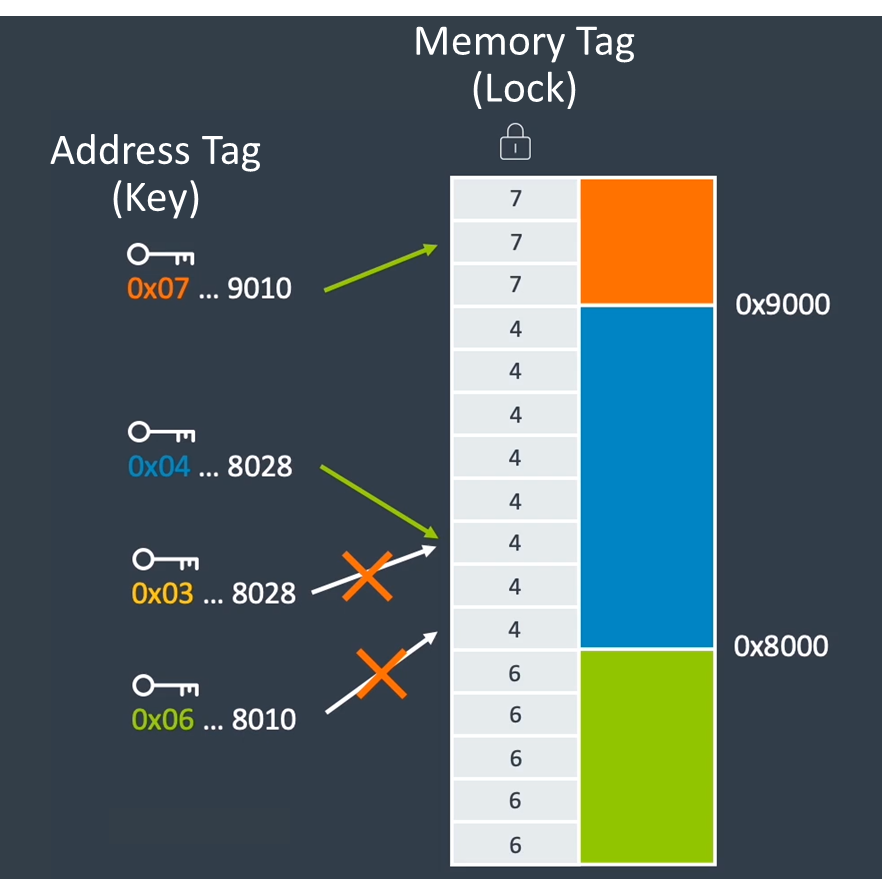
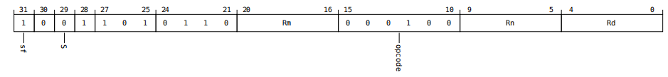
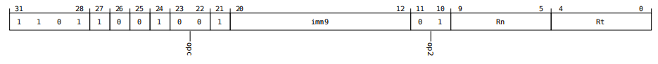
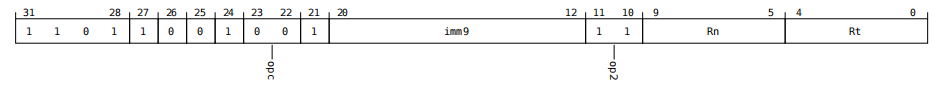
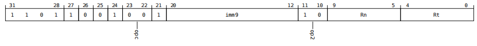

# Memory Tagging Extension

在上一节中，我们介绍了 [PAC(Pointer Authentication Code)](pac.html) 的原理和简单使用，在 ArmV8 版本中，还提供一个全新的扩展名为 MTE(Memory Tagging Extension)。该特性同样利用了 TBI(Top-Byte Ignore) 的特性，使用指针的高 4 位存储 tag，在每个进程中有一段专用的内存用于存储 tag。当为内存制定了某个 tag 后，程序必须带上正确 tag 访问内存，若 tag 错误，程序抛出 `SIGSEGV`，如下图所示：



MTE 的原理是极其简单的，但如何正确的使用/实现 MTE 代码是一件比较复杂的事情 (至少比原理复杂很多)。ArmV8.5-A 提供了一套 MTE 扩展指令集来操作对应的 tag。因此，本节的核心是讲解 MTE 扩展指令集是如何使用，且会给出对应的例子。

### MTE Core Instruction

MTE 提供了许多指令用于 tag 的操作，其核心的指令集是生成和使用对应的 tag，因此我个人认为 MTE 的扩展指令集核心指令就两条：

| Instruction | Example | Meaning |
| :--- | :---: | :--- |
| irg(Insert Random Tag) | IRG RD, RS, RM | 该指令会生成一个随机逻辑地址标签，并将其插入到第一源寄存器中的地址，最后将结果写入目标寄存器。在随机选择逻辑地址标签时，会排除可选的第二源寄存器或 `GCR_EL1.Exclude` 寄存器中指定的标签。 |
| stg(Store Allocation Tag) | STG RT, RS, #Imm | 该指令将一个分配标签存储到内存中。用于存储操作的地址根据基址寄存器和一个经过标签粒度缩放的有符号立即数偏移量计算得出。分配标签则来源于源寄存器中的逻辑地址标签。此指令会执行非检查访问。它包含三种编码类型：Post-index, Pre-index 和 Signed offset。 |

#### IRG Instruction

IRG 指令的第一个寄存器是 RD 寄存器，第二个寄存器是 RS 寄存器，第三个寄存器则是 RM 寄存器；当指令执行时，会生成一个随机 tag 值，并将该值直接插入到 RS 寄存器的高四位中，并写入到 RD 寄存器中；RM 寄存器若缺省则默认为 `XZR`。

``` asm
irg x1, x0
```

IRG 指令会从 `x0` 寄存器中取值，并生成随机 tag 值，将该生成的 tag 值插入到 `x0` 寄存器中的值对应的标签位，并将整个指针 (带标签) 写入到 `x1` 寄存器中。**但是，需要注意，IRG 并不会修改 `x0` 本身的值，只是将 `x0` 的值取出后进行组装**。



#### STG 

STG 指令的第一个寄存器是 RS 寄存器 (源寄存器)，第二个寄存器是 RN 寄存器 (基址寄存器)，第三个字段是立即数值；当指令执行时，STG 会将源寄存器中的 tag 存放到由基址寄存器和立即数值 (offset) 计算得出的位置。立即数值若缺省则默认为 0。

由于 STG 指令需要寻址，因此就需要引入 Arm 中的三种寻址模式：

- Post-index

Post-index 也就是**先使用，后更新**，其表示形式如下：

``` asm
# STG RT, [RS], #Imm9
stg x1, x0, #16
```

假设 `x1` 是通过 `irg` 生成的随机 tag，在这种模式下，STG 会先从 `x0` 寄存器中取出基址进行填入 tag 在基址对应的标签地址处，然后再将 `x0` 与立即数相加得到新的基址。



- Pre-index

Pre-index 也就是**先更新，后使用**，其表示形式如下：

``` asm
# STG RT, [RS, #Imm9]!
stg x1, [x0, #16]!
```

假设 `x1` 是通过 `irg` 生成的随机 tag，在这种模式下，STG 会先将 `x0` 寄存器和立即数进行相加，而后将 tag 填入到相加后的基址对应的标签地址处。



- Signed offset

Signed offset 也就是**只使用，不更新**，其表示形式如下：

``` asm
# STG RT, [RS, #Imm9]
stg x1, [x0, #16]
```

假设 `x1` 是通过 `irg` 生成的随机 tag，在这种模式下，STG 会先将 `x0` 寄存器和立即数进行相加得到临时值，而后将 tag 填入到相加后的基址对应的标签地址处。**注意，这一种类型需要和 `Pre-index` 区分，`Signed offset` 不会更改基址寄存器的值**。



### MTE Other Instruction

上面我们介绍完核心的两个指令后，我们可以通过一个简单的表格来看看其余 MTE 扩展指令：

| **Instruction** | **Name** | **Format** |
| :--- | :--- | :--- |
| ADDG | Add withe Tag | ADDG RD, RS, #Imm6, #Imm4 |
| CMPP | Compare with tag | CMPP RN, RM |
| GMI | Tag Mask Insert | GMI RD, RS, RM |
| ST2G | Store Allocation Tags to two granules | ST2G RT, [RS], #Imm9 <br> ST2G RT, [RS, #Imm9]! <br> ST2G RT, [RS, #Imm9] |
| STGP | Store Allocation Tag and Pair | STGP RT1, RT2, [RS], #Imm9 <br> STGP RT1, RT2, [RS, #Imm9]! <br> STGP RT1, RT2, [RS, #Imm9] |
| STZ2G | Store Allocation Tags to two granules Zeroing | STZ2G RT, [RS], #Imm9 <br> STZ2G RT, [RS, #Imm9]! <br> STZ2G RT, [RS, #Imm9] |
| STZG | Store Allocarion Tag Zeroing | STZG RT, [RS], #Imm9 <br> STZG RT, [RS, #Imm9]! <br> STZG RT, [RS, #Imm9] |
| SUBG | Subtract with Tag | SUBG RD, RS, #Imm6, #Imm4 |
| SUBP | Subtract Pointer | SUBP RD, RN, RM |

当然，上述只是一部分 MTE 扩展指令，更多的请自行参阅 ArmV8.5-A 手册。

## Example

在上文我们了解了 MTE 扩展指令集是什么，以及 MTE 的原理。现在我们来尝试通过一个例子来学习 MTE 扩展如何实际使用 ([点击此处查阅完整代码](https://godbolt.org/z/16eoz7n34))。

``` c
/*
 * Insert a random logical tag into the given pointer.
 */
#define insert_random_tag(ptr) ({                   \
    uint64_t __val;                                 \
    asm("irg %0, %1" : "=r" (__val) : "r" (ptr));   \
    __val;                                          \
})

/*
 * Set the allocation tag on the destination address.
 */
#define set_tag(tagged_addr) do {                                      \
    asm volatile("stg %0, [%0]" : : "r" (tagged_addr) : "memory"); \
} while (0)
```

MTE 扩展并没有对应的 `builtin function`(内建函数) 实现，因此，如果我们想要使用 MTE 扩展，就需要通过内联汇编进行操作，如上就是 C 语言中对于 `irg` 和 `stg` 指令的封装宏。

``` c
#define HWCAP2_MTE              (1 << 18)
unsigned long hwcap2 = getauxval(AT_HWCAP2);
if (!(hwcap2 & HWCAP2_MTE))
    return EXIT_FAILURE;
```

我们想要使用 MTE 扩展，就必须先判断当前 CPU 架构是否支持 MTE 扩展，而在内核向用户空间中提供 MTE 扩展是通过的 HWCAP2_MTE 宏。当确认 CPU 架构支持开启 MTE 扩展后，我们还需要判断 TBI 是否被启用：

``` c
if (prctl(PR_SET_TAGGED_ADDR_CTRL,
          PR_TAGGED_ADDR_ENABLE | PR_MTE_TCF_SYNC | PR_MTE_TCF_ASYNC |
          (0xfffe << PR_MTE_TAG_SHIFT),
          0, 0, 0)) {
    perror("prctl() failed");
    return EXIT_FAILURE;
}
```

这里启用了标签地址 ABI 允许用户空间进程使用地址的最高字节来存储内存标签，也就意味着 MTE 功能被开启。`PR_MTE_TCF_SYNC` 和 `PR_MTE_TCF_ASYNC` 用于设置标签检查故障 (Tag Check Fault, TCF) 的检测模式

- `PR_MTE_TCF_SYNC`：如果发生内存标签不匹配（即指针标签和内存标签不一致），会立即导致一个同步的 SIGSEGV 信号被发送给进程，其行为类似硬件错误（如除以零）。这种模式能提供精确的故障点定位。
- `PR_MTE_TCF_ASYNC`：如果发生标签不匹配，处理器不会立即停止，而是在不影响性能的情况下，将故障信息异步地记录下来。它会在稍后的时间点（例如在进入内核或通过其他机制检查时）触发信号。这种模式的性能开销较小，但定位故障点不够精确。

当同时指定这两个 flag 时，通常表示程序允许在这两者之间选择一个模式允许，由 CPU 以及具体实现来自动选择。而 `0xfffe` 表示允许 MTE 在分配内存时使用标签 1 到标签 15 进行随机分配，禁用了标签 0。最后三位参数均设为 0 是固定搭配。

``` c
unsigned char *a;
unsigned long page_sz = sysconf(_SC_PAGESIZE);

a = mmap(0, page_sz, PROT_READ | PROT_WRITE,
         MAP_PRIVATE | MAP_ANONYMOUS, -1, 0);
if (a == MAP_FAILED) {
    perror("mmap() failed");
    return EXIT_FAILURE;
}

/*
* Enable MTE on the above anonymous mmap. The flag could be passed
* directly to mmap() and skip this step.
*/
if (mprotect(a, page_sz, PROT_READ | PROT_WRITE | PROT_MTE)) {
    perror("mprotect() failed");
    return EXIT_FAILURE;
}

/* access with the default tag (0) */
a[0] = 1;
a[1] = 2;
```

在这一步，我们就需要验证该程序是否在进程内成功启用了 MTE，首先获取系统的页大小，为后续从 mmap 中申请空间做出准备。通过 `mprotect` 来修改已分配内存的保护标志，启用真正的 MTE 功能。**通常而言，`mmap` 和 `mprotect` 操作返回的原始指针，在没有经过显示 `IRG` 操作的情况下，默认的指针标签是 0**。

因此，我们通过 `a[0] = 1` 这样的代码进行访问，确定了目前是合法的。

``` c
/* set the logical and allocation tags */
a = (unsigned char *)insert_random_tag(a);
set_tag(a);

 /* non-zero tag access */
a[0] = 3;

/*
 * If MTE is enabled correctly the next instruction will generate an
 * exception.
 */
a[16] = 0xdd;
```

然后，我们通过 `insert_random_tag` 为 `a` 地址生成一个随机标签，并通过 `set_tag` 将生成的地址标签应用到这块地址中。

``` asm
irg     x20, x20
stg     x20, [x20]

ldrb    w2, [x20, #1]
mov     w8, #3
mov     x0, x19
mov     w1, #3
strb    w8, [x20]
bl      printf
```

然后访问 `a[0]`，可以发现此时是正常访问的，因为当前程序带有了正确的标签，该标签管理了一块 16 字节大小的内存空间。`a[16]` 的访问我们认为会导致一个 MTE  异常，因为 `a[16]` 不在当前标签的管理范围内，因此生成的标签与 `a[16]` 的地址标签不相同 (\\( Tag_{irg} \ne Tag_{0} \\))。

## 参考链接

- [Where is the MTE Tag stored and checed?](https://developer.arm.com/documentation/ka005620/1-0/?lang=en)
- [Linux Mem -- MTE in AArch64 Linux](https://blog.csdn.net/hello_yj/article/details/143142295?spm=1001.2014.3001.5501)
- [Memory Tagging Extension (MTE) in AArch64 Linux](https://www.kernel.org/doc/html/v5.15/arm64/memory-tagging-extension.html)
