# Pointer Authentication Code

## 概念预览

ARMv8.3-A 架构中引入了一种新特性，该特性使得寄存器内容被用作间接分支或数据引用的地址前对其进行认证。该特性利用了一个 64 位地址值中的最高位字节地址，将其作为指针认证码 (Pointer Authentication Code, PAC)。并且，根据该特性引入了对应的指令集。

``` c
int foo(int a, int b) {
    return a + b;
}

int main() {
    foo(1, 2);
    return 0;
}
```

``` asm
foo:
    hint    #34
    sub     sp, sp, #16
    str     w0, [sp, #12]
    str     w1, [sp, #8]
    ldr     w8, [sp, #12]
    ldr     w9, [sp, #8]
    add     w0, w8, w9
    add     sp, sp, #16
    ret

main:
    paciasp
    sub     sp, sp, #32
    stp     x29, x30, [sp, #16]
    add     x29, sp, #16
    mov     w8, wzr
    str     w8, [sp, #8]
    stur    wzr, [x29, #-4]
    mov     w0, #1
    mov     w1, #2
    bl      foo
    ldr     w0, [sp, #8]
    ldp     x29, x30, [sp, #16]
    add     sp, sp, #32
    retaa
```

这是一个经典的示例 ([点击这里打开](https://godbolt.org/z/5qKPKdWYv))，在 `main` 函数中，使用了 `paciasp` 在压栈保存时对 `sp` 指针进行签名。

## Introduce

目前计算机攻击种类繁多，比较经典的就是利用 `Gadgets (攻击者在目标链接程序或库中找到一系列由 *ret* 指令结尾的短指令序列)` 进行攻击的 `Return-Orientated-Programming (ROP)` 和 `Jump-Orientated-Programming (JOP)`。

这里简要讲解一下 `ROP` 和 `JOP` 技术。

- ROP：ROP 不再手动注入 `shellcode`，而是通过劫持并扫描代码中的类似于 `ret` 语句，通过精心构建出预期想要执行的代码片段。
  - 例如：ROP 想要执行 `system("/bin/sh")`，那么就会扫描代码，并找出对应的代码片段组成如下：
    - STACK 8: "/bin/sh"  -> 这里假设是一个 `pop eax; ret` 语句，`eax` 的值为 `/bin/sh`
    - STACK 7: "mov ebx, eax; ret"  -> 假设这里是第一个 `gadgets` 的返回地址处，这里将 "/bin/sh" 存放到合适的寄存器中
    - STACK 6: .... -> 假设经过了多个 `gadgets` 继续配置需要的参数
    - STACK N: "#system" -> 最终，有一个 `gadgets` 返回的地址是 `system` 调用的地址，而前面已经将 `system` 的参数准备到寄存器中了。
  - 至此，ROP 程序就找到了一个由 `gadgets` 集合组成的调用链，通过这一个调用链，就可以无需插入任何 `shellcode` 就能够实现劫持代码并执行。
- JOP：JOP 是 ROP 攻击的一个变种，为了解决 ROP 防御手段而演变的一种攻击，其不再依赖 `ret` 语句，而是通过类似于 `jmp eax` 语句来组成链式执行。并且为 JOP 实现了一个分发器，记录下每一个 `gadgets` 的内存地址，并按照制定顺序进行跳转形成链式执行。

为了抵御上述类型的攻击，ArmV8.3-A 引入了 PAC(Pointer Authentication Code) 特性使得攻击者在未被检测到的情况下更难修改内存中的受保护指针。

## 原理

现代计算机通常启用了 64 位架构，但实际使用中，地址空间又常常小于 64 位，例如：

- X86-64：通常只使用 48 位 或 52 位的有效虚拟地址空间
- ARM64：定义了多种虚拟地址空间大小，通常使用 48 位地址
- RISCV64：定义了多种虚拟地址空间大小，通常使用 39 位地址

因此，**一个 64 位的指针，在实际使用中其高 8 位甚至更多位实际上并没有被用来存储地址信息，而是被标识 `Reserve`。ARM 所设计的 PAC 特性就是将这些没有利用起来的未使用高位利用起来，放置一个指针验证码 (PAC)。**

PA (Pointer Authentication) 使用指针的高位来存储 PAC 信息，该信息本质是使用指针值和一些上下文进行的加密签名：


在程序中，并非每种指针都有相同的用途。我们希望指针仅在特定的上下文中有效。在指针认证中，这通过两种方式实现：为主要用例使用单独的密钥，并通过对指针和 64 位上下文计算 PAC 来实现。

指针认证规范定义了五个密钥：两个用于指令指针，两个用于数据指针，以及一个用于在更长的数据序列上计算 MAC 的单独通用指令。指令编码确定使用哪个密钥。上下文对于隔离与同一密钥一起使用的不同类型的指针非常有用。在计算和验证 PAC 时，上下文被指定为附加参数，与指针一起使用。

\\[
  API\\{A, B\\} Key, APD\\{A, B\\} Key, APGAKey  
\\]

- Code Address: API{A, B}Key
- Data Address: APD{A, B}Key
- General Address: APGAKey

PAC 通过 \\( Val_{pointer} + Context_{64bit} + Secret_{128 bit key} = PAC \\) 组合，实现了上下文相关的指针认证：

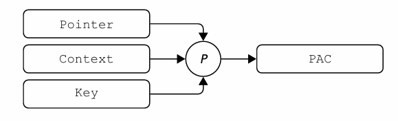

PAC 指令主要由两个步骤组成，签名 (sign) 和 校验 (authenticate)：

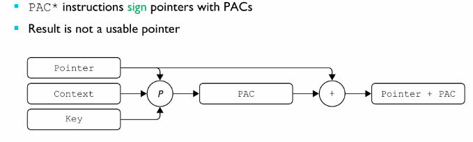

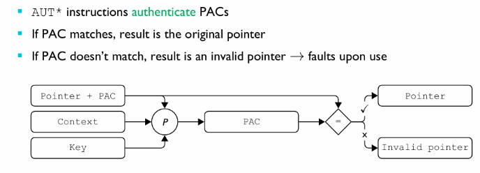

## 文档

基于 [Arm Architecture Reference Manual for A-profile architecture D8.10 Pointer Authentication](https://developer.arm.com/documentation/ddi0487/latest) 翻译并理解而来。

`AArch64` 支持对包含地址的 64 位通用寄存器内容进行指针验证码签名，**并在该寄存器用作间接分支目标或加载/存储指令的基址寄存器之前，对带有 PAC 的寄存器内容进行认证**。

** PAC 起效的一切前提是支持并实现了 `FEAT_PAuth` **

### FEAT_PAuth

`FEAT_PAuth` 功能引入了对寄存器内容进行地址认证的支持，该操作在将寄存器用作间接分支的目标或作为加载操作的地址之前执行。当 `PAuth` 被实现后，以下所有的陈述都是正确的：

- **一定有一种 PAC 算法被实现了**
- `PACGA` 指令和其他 PAC 指令使用了相同的算法

`FEAT_PAuth` 可选的算法有：

- `FEAT_PACIMP`
- `FEAT_PACQARMA5`
- `FEAT_PACQARMA3`

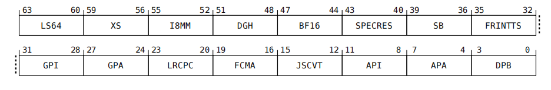

该图是 `ID_AA64ISAR1_EL1` 寄存器字段示意图。

#### FEAT_PACIMP

`FEAT_PACIMP` 允许厂商使用自己的 PAC 加密算法实现，当 `PACIMP` 被实现时：

- `FEAT_PAuth` 一定被实现
- `FEAT_PACQARMA5` 和 `FEAT_PACQARM3` 一定不被实现。


通过查看这两个字段 (`ID_AA64ISAR1_EL1.GPI` 和 `ID_AA64ISAR1_EL1.API`) 来判断 `PACIMP` 是否实现：

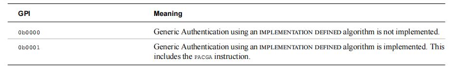

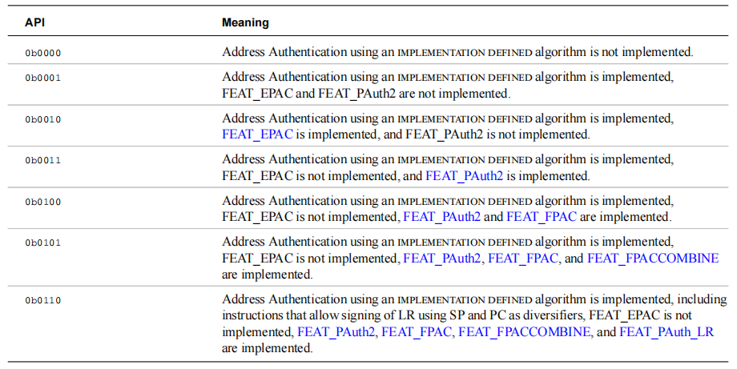

其中 `FEAT_PAuth` 被 `ID_AA64ISAR1_EL1.API = 0b0001` 所标记。

#### FEAT_PACQARMA5

`FEAT_PACQARM5` 使用 `QARM5` 加密算法作为 PAC 的实现，通过查看这两个字段 (`ID_AA64ISAR1_EL1.GPA` 和 `ID_AA64ISAR1_EL1.APA`) 来判断 `QARM5` 是否被启用：

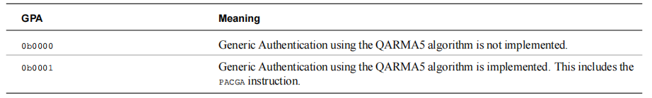

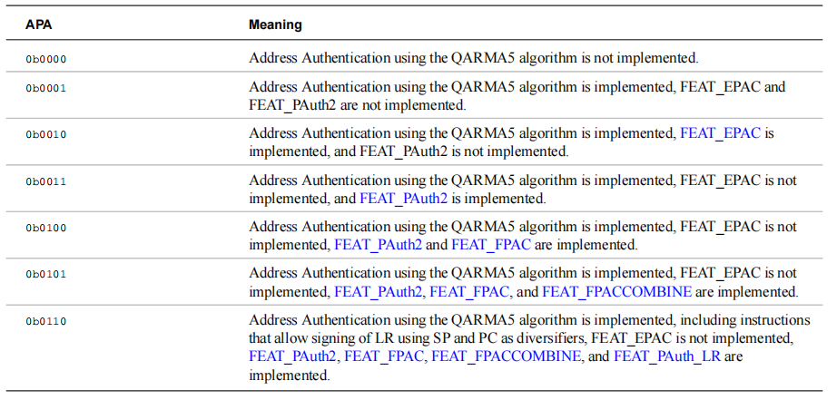

其中 `FEAT_PACQARM5` 被 `ID_AA64ISAR1_EL1.APA` 所标记。

#### FEAT_PACQARMA3

`FEAT_PACQARM3` 使用 `QARM3` 加密算法作为 PAC 的实现，通过查看这两个字段 (`ID_AA64ISAR2_EL1.GPA3` 和 `ID_AA64ISAR2_EL1.APA3`) 来判断 `QARM5` 是否被启用：

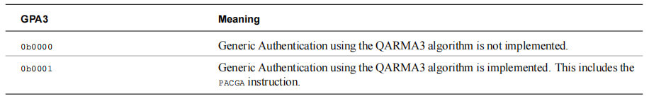

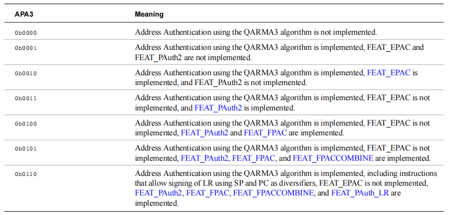

其中 `FEAT_PACQARM3` 被 `ID_AA64ISAR2_EL1.APA3` 所标记。

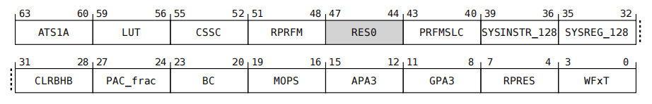

该图是 `ID_AA64ISAR2_EL1` 寄存器字段示意图。

### PAC Usage

上文我们简单介绍了 PAC 的机制，现在我们来理解 PAC 是如何使用的，一个 PAC 指令主要可以分为三个部分：

``` asm
PAC <TYPE> <XN|SP>
```

- `<TYPE>`: 主要指的是加密类型，比如 `IA`、`IB`，也就是说，对指令进行 `A/B` 加密
- `<XN|SP>`：主要指的是使用什么上下文进行加密

例如：

``` asm
PACIASP
```

上面的指令的含义就是，使用密钥 `A` 和 `SP` 的上下文对 `LR` 寄存器进行 PAC 加密。类似的还有指令：

- `PACIX1716`，这里的 `1716` 指的是寄存器 `X17, X16`
- `PACIXZ`，这里的 `Z` 指的是 `zero`

## 参考链接

- [ARMv8.3 的 PAC 特性](http://raverstern.site/en/posts/armv8_3-pac/)
- [ARMV8 安全特性：Pointer Authentication](https://blog.csdn.net/weixin_45030965/article/details/140351221)
