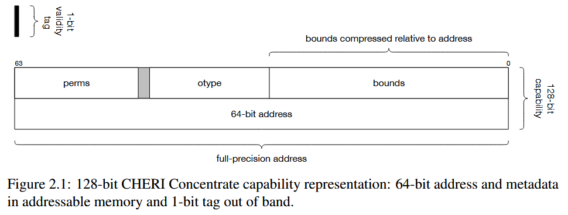
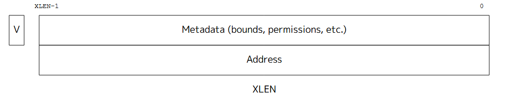
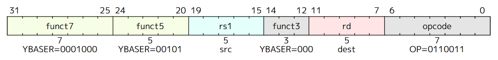
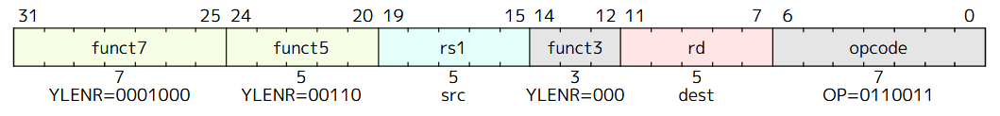
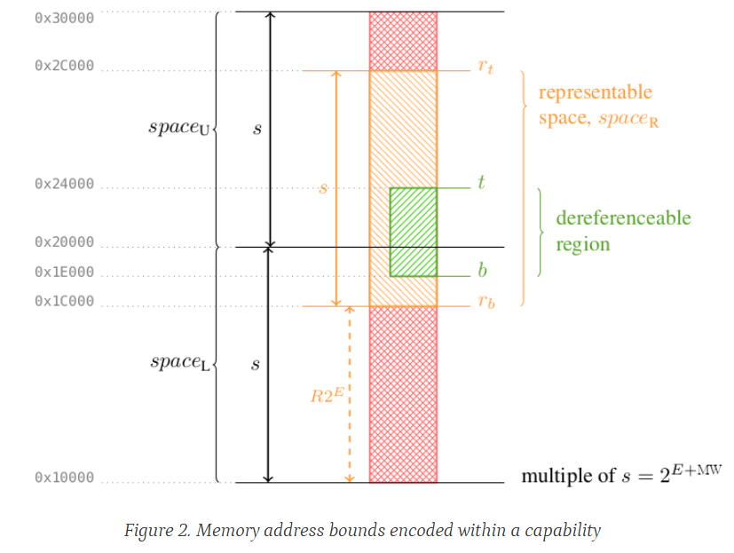
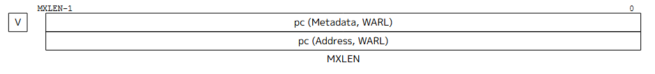
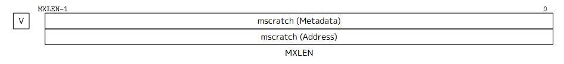

# CHERI Introduce

CHERI (Capability Hardware Enhanced RISC Instructions) 通过新的架构特性扩展了传统的硬件指令集架构 (ISAs)，从而实现细粒度 (fine-grained) 的内存保护和高度可扩展 (highly scalable) 的软件划分。

CHERI 是一个硬件/软件/语义 (hardware/software/semantics) 协同设计项目，结合了架构设计、硬件实现、主流软件栈的适配以及形式化语义和证明。

本章主要讲解 CHERI 的原理以及其表现形式。

## The CHERI Architecture

CHERI 扩展了使用机器码 (machine words) 来表示语言层面的整数和指针的传统指令集；采用了一种新的硬件支持的类型数据，名为 Architectural Capability (架构能力，后续称为 capability)。Capability 可用于保护那些旨在用作代码或数据指针的 (Virtual) 地址——包括源语言产生的地址，以及那些用于语言特性底层实现的地址。

与现有类型的硬件支持的数据 (整数、浮点数、向量等等) 一样，Capability 使用新的指令 (Capability-aware Instructions) 来加载、存储和操作。

### Capabilities

在 CHERI 的设计中，Capability 是基线架构中原生整数指针类型宽度的两倍，例如：64 位平台上为 128 位 Capability。因为 Capability 类似于一种携带元数据的 "Fat Pointer"，为了容纳这些元数据，CHERI 架构选择将总宽度增加一倍以高效的存储地址和安全元数据。

> 这里的 "Fat Pointer" 是我个人的理解，Capability 在中文中的含义是能力，也就是说 Architectural Capability 是通过携带了额外元数据来使得该 Pointer 具有一定的功能来完成所需要的操作行为 (Capability)。

Capability 的字段由上图可见，其中每一个元素都有助于保护 CHERI 模型，并且由硬件强制执行：

- **Validity Tag**：有效性标签跟踪一个 Capability 的有效性；如果该 Capability 无效，则不能用于任何加载、存储、指令获取或其他操作。如果遵循 [Architectural Rules for Capability Use](#architectural-rules-for-capability-use) 所描述的规则，仍可以从一个无效的 Capability 中提取出对应的字段，包括其地址；而 Capability-aware 指令在 Capability 被加载、存储以及在 Capability 字段被访问、操作和使用时都会保持该有效性标签 (如有需要)。
- **Bounds**：上界和下界描述了 Capability 授权进行加载、存储和指令获取的地址空间的权限范围。
- **Permissions**：权限掩码 (Permissions mask) 控制了 Capability 的使用方式，例如，通过限制数据的加载、存储或限制 Capability 本身的加载和存储等等。
- **Object Type**：对象类型 (Object Type) 字段如果不等于 `-1`，则对应的 Capability 被这个对象类型所密封 ("Sealed")，并且不能被修改和解引用。

#### Address Field

Capability 的低 `XLEN` 位编码指向了 Capability 指向的地址。这也被称为 Capability 的整数部分。对于被扩展但当前持有无效的 Capability 数据的寄存器，所有其他字段通常为零。

#### Capability Tag Field (Validity Tag)

Capability 标签**是一个额外的附加位，被添加到可寻址内存和所有 `YLEN` 位的寄存器中。它可以被单独存储，并且可能被称为 "out of bound" 或隐藏的，并由硬件管理。**该标签指示一个 `YLEN` 位的寄存器或 `YLEN` 位对齐的内存位置是否包含一个有效的 Capability。如果该标签被设置，则对应的 Capability 是有效的，并且可以被解引用 (具体允许的操作取决于权限)。

**所有能够容纳一个 Capability 的寄存器或内存位置都是具有 `YLEN` 位的宽度，并且附加了一个 Capability 有效位标签**。

值得注意的是，**Capability 标签不能够被常规意义上通过位操作置一来启用。如果 Capability 标签被启用，则表明该 Capability 是根据 [Architectural Rules for Capability Use](#architectural-rules-for-capability-use) 所表述的规则正确派生 (derived) 出来的。如果遵循这些规则，那么在修改、加载或者存储 Capability 的指令执行过程中，该标签得以传播**。

因此，对于寄存器中的 Capability 操作有以下规则：

- **Provenance Check：任何将 Capability 写入寄存器的指令，其输入操作数中至少有一个 Capability 标签被设置**。
  - 这遵循了有效性原则，一个新的 Capability 的建立一定是由一个已经存在的 Capability 通过指令创建的。
- **Montonicity Check：任何将 Capability 写入寄存器的指令，都需要保证该操作不会增加 Bound 或者权限，并且设置了输出上的 Capability 的有效性标签**。
  - 这遵循了单调性原则，一个衍生 Capability 的权限不会超过其父类的权限集合。
- **Integrity Check：任何将 Capability 写入寄存器的指令，都会检测是否存在被损坏的值。**
  - 这确保了 Capability 的各项元数据是合法并且正确的。
- **Capability 的加载和存储操作都需要经过 Provenance Check**：
  - 任何将 Capability 写入内存的存储操作都经过了正确的授权
  - 任何从内存中读取 Capability 的加载操作都经过了正确的授权
  - 当一个操作由于软件错误或恶意企图而未能通过检查时，该操作会引发一个异常（exception）或将所产生的 Capability 对应的标签设置为零。
  - 使用无效的 Capability 来解引用内存或授权任何操作都会引发异常。所有源自无效的 Capability 的衍生 Capability 都是无效的，即它们的 Capability 标签为零。

##### Capability tags in registers

每个 `YLEN` 位的寄存器都带有一个一位的 Capability 标签，用于指示寄存器中的 Capability 是否有效，可以被解引用。每当执行无效的 Capability 操作时，该标签就会被清除。此类无效操作的例子包括：只写入寄存器的整数部分（地址字段），或试图增加边界或权限。

##### Capability tags in memory

Capability 标签是通过内存子系统进行跟踪的：每个对齐的 YLEN 位宽区域都有一个不可寻址的一位 Capability 标签，硬件会与数据一起以原子方式管理它。

如果该 YLEN/8 对齐内存区域中的任何字节被写入时，所使用的操作不是一个合法的 Capability 存储操作或该操作不具备设置标签的权限又或是被存储的 Capability 本身的标签就是无效的，那么该 Capability 标签就会被清除为零。

所有存储 Capability 的系统内存和缓存都必须保留这种抽象，以原子方式处理 Capability 标签和数据。

#### Capability Bounds Field

Capability 编码了内存边界 (Bounds)，**即当被解引用以进行数据内存访问或指令执行时，允许其访问的内存中的最低和最高字节**。

检查是按字节进行的，因此内存访问可能是完全在边界内 (fully in-bounds)、部分超出边界 (partially out-of-bounds) 或完全超出边界 (fully out-of-bounds)。不允许进行任何部分或完全超出边界的内存访问。

每个 Capability 都有两个内存地址边界：

- 基址 (Base)：代表最低可访问字节，Base 是 `XLEN` 位宽的，并且是包含的 (inclusive)
- 顶址 (Top)：代表最高可访问**字节之上的一个字节**，Top 是 `XLEN + 1` 位宽的，并且是排他的 (exclusive)

因此，一个 Bounds 所表达的范围为：\\( Top - Base, \[Base, Top)\\)。因此对于一个内存地址 `A` 而言，如果 \\( Base \le A \lt Top \\) A 位于边界内，则说明其是可以有效被访问的。

> 检查每条已执行指令的每个字节和每次数据内存访问的每个字节，是 CHERI 提供的内存安全性的基础。在一个典型的加载/存储单元中，对来自 `rs1` 的边界扩展和边界检查是与地址计算、内存转换和 (或) PMA/PMP 检查并行进行的。

Capability 中边界的编码采用了类似浮点数的方案 (该压缩方法较为复杂，因此目前暂且不分析)，使用一个指数 (exponent) 和一个尾数 (mantissa) 的压缩格式。因此，较小的指数可以允许边界具有字节级 (byte granularity) 的粒度，而较大的指数则会给出更粗糙的粒度 (coarser granularity)。

在 CHERI 中，提供了两条指令进行获取边界的元数据：`YBASE` 和 `YLENR`，通过这两个指令的结果进行加法运算即可得到可访问的最高位地址。**需要注意的是，YBASE 和 YLENR 寄存器的结果采用的是饱和加法计算 (Saturating Addition，当运算结果溢出时，其结果会直接固定在最大的可能值上，即\\( A + B \ge 2^N - 1, A + B = 2^N - 1\\))**。

#### Cpability Type Field (CT, Object Type)

这个元数据值指示了 Cpability 的类型。在 `RVY` 基础指令集架构中定义的唯一类型是 `0`。

类型决定了该 Cpability 授权哪些操作；RVY 的扩展将定义额外的类型，并为具有此类类型的 Cpability 赋予额外的语义。**一个给定的 CHERI 平台支持哪些 Cpability 类型，取决于所使用的扩展和 Capability 编码格式**。

Cpability 编码格式还会指定一种映射，将格式中的某些位 (通常描述为“CT 字段”) 与 Cpability 类型的空间关联起来。该映射必须能够编码 `Type 0`，但几乎没有其他要求。例如，它不需要被解释为 CT 值的（带符号或无符号）二进制表示。

- Unsealed Capability
  - 当 \\( CT = 0 \\) 时，该 Cpability 授权访问一块内存区域，其具体权限和界限由 Cpability 中的权限 (permissions) 和 界限 (bounds) 字段定义。
- Sealed Cpability
  - 当 \\( CT \ne 0 \\) 时，该 Capability 被密封 (Sealed)；**不能被修改，也不能被解引用来访问内存。如果对 Capability 进行操作的指令遇到了密封的 Capability，并且该操作会改变其地址、界限或权限，则会产生一个 Capability 标签被清除的结果 (即结果不再是一个有效的 CHERI Capability)。任何扩展如果增加了 Capability 的元数据，必须描述他们与被密封的 Capability 之间的交互方式**。

给定一个 \\( CT = 0 \\) 的 Capability，从中派生出一个 \\( CT \ne 0 \\) 的 Capability，这个过程被称为**密封 (Sealed)**。如果特指输出的 Capability 类型，则称为**以类型 x 密封 (sealing with type x)**，其中 \\( CT = 0 \\) 是指特定的非零 Capability 类型。

反之，从一个 \\( CT \ne 0 \\) 的 Capability 中派生出一个 \\( CT = 0 \\)  的 Capability，这个过程被称为**解封 (unsealing)**。如果特指输入的非零 Capability 类型，则称为**从类型 x 解封 (unsealing from type x)**，其中 \\( CT = 0 \\)  是指特定的非零 Capability 类型。

- Ambient Sealing Type (环境密封类型)
  - 某些 Capability 类型被称为**环境可用 (ambiently available)（或简称“环境类型”），如果它们不需要特定的授权**即可用作密封一个 Capability (用该类型) 的类型。
  - 例如，如果 Zys 在给定平台上可用，那么它用来密封 Capability 的那个类型就被认为是环境可用的。（在使用 Zydefaultcap 的 Capability 编码时，该类型将是类型 1。）
- Sentry Capability Type (哨兵 Capability 类型)
  - 在 CHERI 软件系统中，拥有不可变 (immutable) 的函数指针是非常有用的。密封的 Capability  (Sealed capabilities) 是一个自然的基础，因为它们提供了不可变性。JALR (RVY) 指令在将 Capability 安装到程序计数器 (program counter) 之前，可能会解封 (unseal) 具有特定、由编码格式指定的类型的 Capability。使用此类类型密封的 Capability 被称为**“哨兵” (sentries)**（这个词是 "sealed entries" 即“密封入口”的合成词）。JALR (RVY) 也可能使用由编码格式指定的类型，来密封它生成的返回指针 (return pointers)。

#### Architecture Permissions Field (AP, Permissions)

这个元数据字段编码了 Capability 架构上定义的权限，权限授予访问权限的前提是：

1. Capability 标签必须设置被有效状态
2. 该 Capability 必须未密封 (Unsealed)
3. 界限检查必须通过

值得注意的是，任何操作还取决于其他 RISC-V 架构特性（例如虚拟内存、PMP 和 PMA）所施加的要求，即使 Capability 本身授予了足够的权限。目前在 RVY 中定义的权限列在下方。权限可以在派生新的 Capability 值时（使用 YPERMC 指令）被清除 (cleared)，但它们永远不能被添加。

| **Permission** | **Type** | **Comment** |
| --- | --- | --- |
| R | Data memory permission | Authorize data memory read access，**Allow reading data from memory** |
| W | Data memory permission | Authorize data memory write access，**Allow writing data to memory** |
| X | Instruction memory permission  | Authorize instruction memory execute access，**Allow instruction execution** |
| C (Capability) | Data memory permission  | Authorize loading/storing of capability tags |
| LM (Load Muatble) | Data memory permission  | Used to restrict the permissions of loaded capabilities |
| ASR (Access System Registers) | Privileged state permission  | Authorize privileged instructions and CSR accesses |

C (Capability) 权限控制着内存加载和存储操作中 Capability 标签 (capability tags) 的处理方式：**如果同时授予了 R/W 权限，那么就允许从内存中读取 Capability 标签/将 Capability 标签写入到内存；但如果 C 权限缺失，那么在执行 Capability 加载 (capability loads) 和 Capability 存储 (capability stores) 操作时，Capability 标签将被读取和写入为零 (zero)**。

| Who | Permission | Operation | Result | Rules |
| --- | --- | --- | --- | --- |
| \\( C_{ptr} \\) | R, W, C | \\( C_{ptr} \\) 将内存 A 处的 Capability 加载到寄存器中 | 寄存器获得带有完整标签的 Capability  C | C 权限允许读取标签 |
| \\( C_{data} \\) | R, W | \\( C_{data} \\) 将内存 A 处的有效 Capability 加载到寄存器中 | 寄存器获得标签被清除的 Capability，转变为一个普通指针 | C 权限缺失，标签被读取清零 |
| \\( C_{store} \\) | R, W | \\( C_{store} \\) 将一个有效 Capability 存储到内存地址 A 处 | 内存 A 处存储的值标签被清除，只存储数据部分 | - |

LM (Load Muatble) 权限授权保留从内存中加载的 Capability 的 W 权限 (Write Permission)。**如果一个 Capability 授予了 R 权限和 C 权限，但没有授予 LM 权限，那么通过这个授权 Capability 加载的 Capability 将失去其 W 权限和 LM 权限 (当然，必须满足 CHERI 被启用且非密封权限)**。

假设有一个代码段要将一块可写内存的 Capability  \\( C_{src} \\) 传递给另一个代码段，且 C_{src} 拥有 R, W, C, LM 权限。

| Who | Permission | Operation | Result | Rules |
| --- | --- | --- | --- | --- |
| \\( C_{auth} \\) | R, C, LM | \\( C_{auth} \\) 从内存中加载 \\( C_{src} \\) | \\( C_{dst} \\) 拥有 R, W, C, LM 权限 | \\( C_{auth} \\) 授予了 LM 权限，因此允许保留 \\( C_{src} \\) 中的 W 权限 |
| \\( C_{auth} \\) | R, C | \\( C_{auth} \\) 从内存中加载 \\( C_{src} \\) | \\( C_{dst} \\) 拥有 R, C 权限，缺失 M，LM 权限 | \\( C_{auth} \\) 未被授予 LM 权限，因此不被允许保留 \\( C_{src} \\) 中的 W 权限 |

ASR (Access System Registers) 主要用于授权对控制和状态寄存器 (CSR) 的访问：**授权对所有特权 CSR、一些非特权 CSR 以及一些特权指令进行读写访问**。在 RVY 中，唯一受影响的 CSR 是非特权的 utidc CSR。写入 utidc CSR 需要 ASR 权限，但读取则不需要。

**ASR 权限的权限检查总是使用程序计数器 (PC) 中的权限**。

### Architectural Rules for Capability Use

CHERI 架构在修改 Capability 元数据时强制执行几项重要的安全属性。首先涉及单条指令执行的属性：

- **Provenance Validity (来源有效性)**：确保有效 Capability 只能通过显式构造的指令（例如，不能通过字节操作）从其他有效的 Capability 中创建。此属性适用于寄存器和内存中的 Capability (capability in register, capability in memory)。
- **Capability Monotonicity(单调性)**：确保任何指令构造新的 Capability 时（密封操作和异常引发除外），其权限和范围不得超过派生该 Capability 的原始 Capability。
- **Reachable Capability Monotonicity (可达单调性)**：确保任意代码执行过程中，在将执行权移交给其他域之前，可达 Capability 的集合（当前程序状态可通过寄存器、内存、密封、解封及构造子 Capability 访问的 Capability）不会增加。

**在启动时 (boot time)，架构为固件提供初始的 Capability，允许跨整个地址空间进行数据访问和指令获取。同时，所有内存中的标签被清除。随后，当 Capability 从固件传递到引导加载程序、从引导加载程序到虚拟机监视器、从虚拟机监视器到操作系统，再从操作系统到应用程序时，可按照单调性属性派生出新的 Capability。在派生链的每个阶段，权限和范围可被进一步限制以缩小访问范围**。

同样，Capability 具有**intentionality (意图传递性)**：当进程将能力作为参数传递给系统调用时，操作系统内核可谨慎地仅使用该能力进行操作，确保不会访问用户进程未授权的其他进程内存——即使内核可能通过其持有的其他能力拥有访问整个地址空间的权限。这一点非常重要，因为它防止了"权限混淆"问题，即高权限方代表低权限方行动时，滥用超额权限执行非授权操作。

### General-Purpose Capability Registers

CHERI Capability 可以保存在 Capability 寄存器中——即经过扩展以容纳 Capability 标签和完整的数据宽度的架构寄存器——也可以保存在带标签的内存中。当 Capability 位于寄存器中时，它们可以作为 Capability-Aware 指令的操作数，用于检查、操作、解引用或以其他方式对 Capability 进行操作。

对于通用寄存器文件，CHERI 可以通过两种方式实现：

- 分离式寄存器文件 (A Split Capability Register File)：引入一个新的通用 Capability 寄存器文件，类似于浮点寄存器文件，以补充现有的通用整数寄存器文件。
- 融合式寄存器文件 (A Merged Capability Register File)：扩展现有的通用整数寄存器，使其包含容纳 Capability 所需的标签和额外宽度，类似于将 16 位架构扩展到 32 位、或将 32 位架构扩展到 64 位的做法。

随着 Capability 在寄存器和内存之间移动，标签会跟踪有效、未损坏的 Capability 在整个系统中的流向，从而控制 Capability 未来的使用。

**对于 Capability 寄存器本身，而不仅仅是内存位置，进行标签标记可以实现对 Capability 无感知 (capability-oblivious) 的代码（capability-oblivious code）：例如，C 语言的 memcpy() 函数会利用 Capability 加载和存储指令，以便在适当对齐的内存复制操作中，任何有效的标签都将被保留，从而保持指针的可解引用性，但同时它也能够复制未带标签的普通数据**。

### Special Capability Registers

除了通用 Capability 寄存器之外，一些现有的专用寄存器需要扩展到 `YLEN` 宽度，并且还需要一些全新的 Capability 宽度专用寄存器。

例如，架构的程序计数器 (Program Counter, PC) 和异常程序计数器 (Exception Program Counter, EPC) 被扩展为完整的 Capability，从而允许 Capability 约束控制流 (PCC)，并在异常处理期间得到正确的保存和恢复 (EPCC)。

另一个专用的 Capability 寄存器是 DDC (Default Data Capability)，它自动地间接控制所有基于整数的加载和存储操作，从而允许使用 Capability 来约束非能力感知代码。

根据基线架构的不同，可能还需要其他扩展，例如处理基于 Capability 的**线程本地存储 (Thread-Local Storage)** 访问。

### Capability-Aware Instructions

CHERI 新增了一些指令集到基线架构中，用来执行如下几类函数：

- Retrieve capability fileds (检索能力字段)：检索各种 Capability 字段的整数值，包括其标签 (tag)、地址 (address)、权限 (permissions) 和对象类型 (object type)
- Manipulate capability fields (操纵能力字段)：设置或修改各种 Capability 字段，受限于单调性原则（即只能缩小权限或范围，不能扩大），包括地址、权限和对象类型。
- Load or store via capabilities (通过 Capability 加载或存储)：通过一个获得适当授权的 Capability 来加载或存储整数、Capability 或其他值。
- Control flow (控制流)：执行跳转 (jump) 或跳转并链接寄存器 (jump-and-link-register, JALR) 到一个 Capability 目标地址。
- Special capability registers (特殊能力寄存器)：检索和设置特殊能力寄存器的值——例如，在异常处理期间异常程序计数器能力 (Exception Program-Counter Capability, EPCC) 的值。
- Compartmentalization (区隔化)：这些指令支持快速保护域 (protection-domain) 转换。

CHERI 的一个重要方面在于其 Intentionality (意图性原则)：

- 指令期望的操作数要么是能力 (capability)，要么是整数 (integer)。
- 指令绝不会根据标签值动态地选择一种解释或另一种解释。
- 安全机制：如果一个能力相对的加载、存储或其他操作试图使用一个无标签的能力值 (untagged capability value) 进行访问，将抛出硬件异常。
